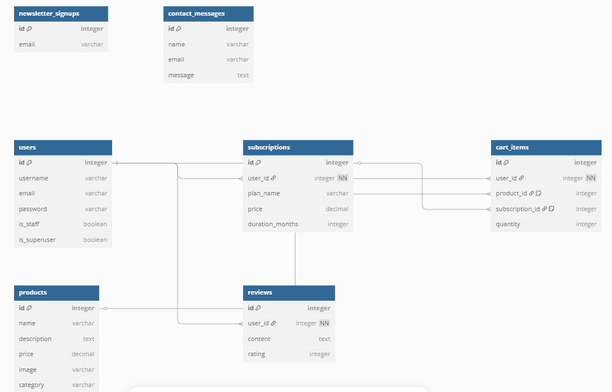

# GetFitQuick: Health & Fitness Subscription App  
[Live Site on Heroku](https://getfitquick-app-794907a0eebb.herokuapp.com)

---

### ⚠️ Developer Note & Apology

Please note the commit history during the early stages of this project is limited. This was due to professional responsibilities in my full-time role working in a residential children's home. I was recently promoted to Deputy Manager and am currently acting as Interim Manager while my manager is on maternity leave. This impacted my availability, but I remained committed to completing this project with quality and care.

---

## Project Overview

**Purpose:**  
GetFitQuick is a subscription-based fitness and nutrition service that provides users with access to premium fitness products, personalized subscription plans, contact support, and newsletters.

**Key Features:**
- Secure user authentication and signup
- Shopping cart system
- Product listings and categories
- Monthly subscription options
- Newsletter signup form
- Contact form with thank-you confirmation
- Review page where logged-in users can leave reviews

---

## Deployed Site
- **Site Images**
 

## UX

### Color Scheme
- **Background Colors:** `#343a40`, `#69aaf9`
- **Action Buttons:** `#dc3545`, `#4CAF50`, `#007bff`
- **Text & Highlights:** `#fff`, `#ff6347`, `#eeecec`

### Typography
- **H1-H6:** [Lobster](https://fonts.google.com/specimen/Lobster)
- **Body Text:** [Open Sans](https://fonts.google.com/specimen/Open+Sans)
- **Fallback Font:** `sans-serif`

---

## Data Schema
## Data Schemas

### Products
| Field       | Type      | Description                    |
|-------------|-----------|-------------------------------|
| id          | Integer   | Unique product ID              |
| name        | String    | Name of the product            |
| description | Text      | Product description            |
| price       | Decimal   | Product price                 |
| image       | String    | Image file path or URL        |
| category    | String    | Product category              |

### Cart Items
| Field           | Type       | Description                                |
|-----------------|------------|--------------------------------------------|
| id              | Integer    | Unique cart item ID                       |
| user_id         | Integer    | Reference to the user owning the cart item|
| product_id      | Integer    | Reference to the product (nullable if subscription) |
| subscription_id | Integer    | Reference to the subscription (nullable if product)  |
| quantity        | Integer    | Number of product units added              |

### Reviews
| Field      | Type       | Description                               |
|------------|------------|-------------------------------------------|
| id         | Integer    | Unique review ID                          |
| user_id    | Integer    | Reference to the user who wrote the review|
| content    | Text       | User’s written review comment              |
| rating     | Integer    | Numeric rating given by user (e.g., 1-5)  |

### Subscriptions
| Field          | Type       | Description                              |
|----------------|------------|------------------------------------------|
| id             | Integer    | Unique subscription ID                   |
| user_id        | Integer    | Reference to the user who subscribed     |
| plan_name      | String     | Name of the subscription plan            |
| price          | Decimal    | Price of the subscription                 |
| duration_months| Integer    | Length of subscription in months          |

### Contact Messages
| Field      | Type       | Description                       |
|------------|------------|-----------------------------------|
| id         | Integer    | Unique message ID                |
| name       | String     | Sender’s name                    |
| email      | String     | Sender’s email                   |
| message    | Text       | Message content                  |

### Newsletter Signups
| Field      | Type       | Description                      |
|------------|------------|----------------------------------|
| id         | Integer    | Unique signup ID                 |
| email      | String     | Email address                    |

---

## User Stories

### New Users
- As a new site user, I want to create an account, so that I can leave personalised reviews.
- As a new site user, I want to be able to securely checkout with confirmation.
- As a new site user, I want to be able to sign up to a gym subscription.
- As a new site user, I want to be able to contact support if required.

### Returning Users
- As a returning user, I want to be able to see my previous reviews.
- As a returning user, I want to be able to manage my cart.

---

## Wireframes
In order for best practices to be used, I developed wireframes to potray what the website should look like, I have included desktop and mobile view for frames that require a different layout due to sizing for mobile view.
I have used [Wireframe](https://wireframe.cc) to design the wireframes for my site.
- **Desktop Wireframes**

- **Mobile Wireframes**

---

## Features

### Existing Features
- **Login & Signup Pages**
- **Product Listings**
- **Subscription Options**
- **Cart Functionality**
- **Review Page**
- **Contact Form**
- **Thank You Page**
- **Newsletter Signup**

---

## User Testing

Manual testing was conducted with real users to test major functionality.

| Task | Description | Result |
|------|-------------|--------|
| Contact Form Submission | Users asked to fill and submit the contact form |  All passed |
| Checkout Process | Users asked to add subscription and complete checkout |  All passed; email confirmation received |
| Navigation | Users asked to click each link in navbar/footer |  All links functional |
| Review Submission | Logged-in users asked to submit a review |  All passed |

---

## Bugs & Fixes

### Major Bugs
- **Deployment Issue**: Products and subscriptions did not initially deploy due to missing migrations.  
  **Fix**: Ran `python manage.py makemigrations` and `migrate` on Heroku.

- **Review Model Error**: `relation "reviews_review" does not exist` — caused by un-run migrations.  
  **Fix**: Migration applied and pushed.

- **TemplateNotFound**: Wrong template path caused 500 errors.  
  **Fix**: Corrected file name and location.

- **HTTPS Issue**: Could not view app on Microsoft Edge due to HTTPS restriction not allowing fallback to HTTP.  
  **Fix**: Used Google Chrome for development and testing.

- **Subscription Cart Bug**: Previously allowed adding duplicate subscriptions to cart.  
  **Fix**: Logic added to restrict one subscription per user.

- **Form Submission Path Bug**: Contact form error caused by inconsistent file path compared to other apps.  
  **Fix**: Standardized form action and view linkage.

---

## Future Features
- Admin dashboard for managing user subscriptions
- User profiles with subscription history
- More review filtering/sorting tools

---

## Tools & Technologies Used

### Frontend
- HTML
- CSS
- Bootstrap 5
- JavaScript

### Backend
- Python
- Django
- PostgreSQL

### Deployment
- **VS Code** for development
- **Heroku** for deployment
- **Git & GitHub** for version control

---

## Debugging & Validation Tools

- [Google Fonts](https://fonts.google.com): Used for Lobster, Montserrat, and Open Sans typography
- [Google Lighthouse](https://developers.google.com/web/tools/lighthouse): Used for performance, accessibility, and SEO testing
- [Wireframe.cc](https://wireframe.cc): Used to design wireframes for mobile and desktop views
- **ChatGPT**: Used to support code debugging, error tracing, and structural planning
- **Stack Overflow**: Used to resolve technical issues and assist with coding patterns (some adapted code was edited from Stack Overflow solutions)

---

## Validation

### HTML Validation
Validated using [W3C Validator](https://validator.w3.org/)

### CSS Validation
Validated using [W3C CSS Validator](https://jigsaw.w3.org/css-validator/)

### Lighthouse
[Lighthouse test](documentation/screenshots/lighthouse_testing.png)
Tests passed for:
- Accessibility - 98
- SEO - 90
- Best Practices - 100
- Performance - 99

---

## Database Design

### PostgreSQL Relational Database
- Hosted via Heroku
- Used Django
- Custom models: Product, Subscription, CartItem, Review, Newsletter

---

## Testing

### Function & Links
| Test | Outcome |
|------|---------|
| Product links | Pass |
| Cart logic | Pass |
| Newsletter comment submission | Pass |
| Review submission | Pass |
| Contact form | Pass |
| Login/Logout | Pass |

### Responsiveness
| Device | Outcome |
|--------|---------|
| Desktop | Pass |
| Tablet | Pass |
| Mobile | Pass |

---

## Deployment

### Heroku

The live deployed application is hosted on [Heroku](https://getfitquick-app-794907a0eebb.herokuapp.com)

**Required files for deployment:**
- `requirements.txt`
- `Procfile`
- `.python-version`

---

## Acknowledgements

- Thanks to Code Institute for project structure ideas
- Thanks to ChatGPT for assistance with debugging
- Stack Overflow contributors
- Bootstrap for styling framework
- Google Fonts for typographic resources
- My mentors Cheryl and Rory for Assisstance and aid with the development of my site
